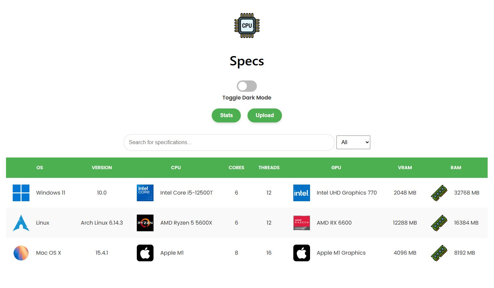
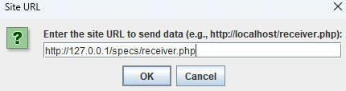
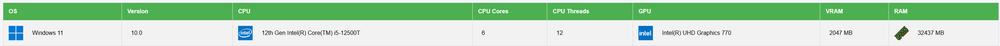

# Specs Server
- Specs Server allows you to make a web server that allows you to use the "validation" function of the [Specs](https://github.com/enzo-quirici/Specs/
  ) application.  
  
## How to install it :
- Go to you server folder and Clone the repository
```Bash
git clone https://github.com/enzo-quirici/Specs/tree/master  
```
- Set up a MYSQL server and add this
```MYSQL
CREATE DATABASE Specs;

USE Specs;

CREATE TABLE system_specs (
    id INT AUTO_INCREMENT PRIMARY KEY,
    os VARCHAR(100),                       
    version VARCHAR(50),
    cpu VARCHAR(100),
    cores INT,                            
    threads INT,                    
    gpu VARCHAR(100),                      
    vram INT,
    ram INT,                    
    timestamp DATETIME DEFAULT CURRENT_TIMESTAMP        
);

```
open the file "recevier.php" and "display_data.php" and change the information needed for the database.

### E.G :
```Bash
// Database parameters
$host = 'localhost';     // Database host
$db = 'specs';           // Database name
$user = 'root';          // Database user
$pass = '';              // Password
$port = 3306;            // Custom MySQL port
```
## Utilisation :
- Open the Specs app and go to file --> Validate
- Enter the server address (E.G : http://127.0.0.1/specs/receiver.php)  

- Click on OK
- Check if it works at the address of the website (E.G : http://127.0.0.1/specs/display_data.php)  
